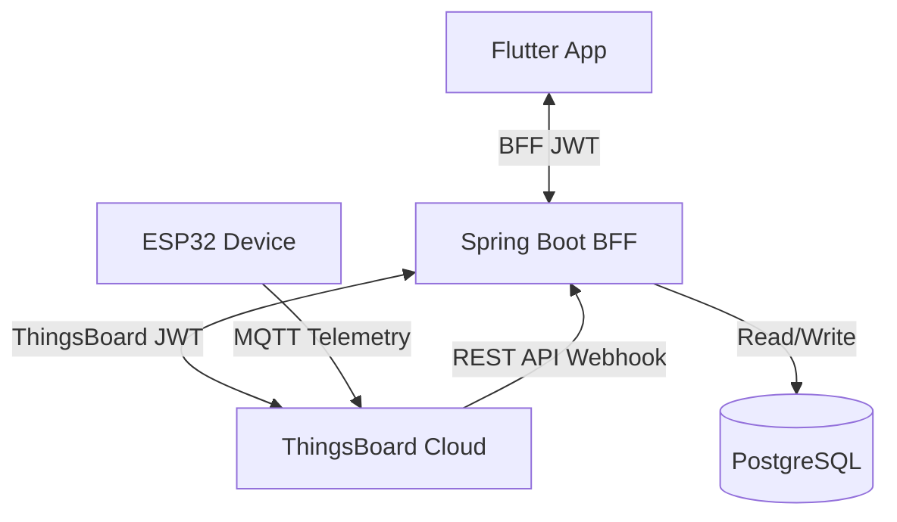

# Brainstorming Report: Spring Boot BFF Architecture for ThingsBoard IoT Project

## 1. Context & Objectives
- **Current Model**: Device (ESP32) -> ThingsBoard <- Flutter (Direct Auth, Telemetry, RPC).
- **New BFF Model**: Device -> ThingsBoard; Flutter <-> Spring Boot BFF <-> ThingsBoard.
- **Goals**:
  - Secure and mediate authentication between Flutter and ThingsBoard.
  - Proxy telemetry & RPC commands.
  - Persist telemetry and command history in PostgreSQL (BFF DB).

## 2. Key Architecture Decisions

### A. Authentication & Session Management
- **Flow**: Flutter -> BFF login (`/api/auth/login`) -> BFF proxies to ThingsBoard.
- **Option 1 (Stateless JWT Mapping - Recommended)**:
  - BFF authenticates with ThingsBoard on user login, receives ThingsBoard JWT.
  - BFF issues a Spring Boot JWT containing encrypted/encoded ThingsBoard JWT in the claims.
  - Flutter uses this BFF JWT for subsequent calls.
  - BFF security filter decodes/decrypts the ThingsBoard token from the claims to make downstream calls.
  - *Pros*: Completely stateless, zero session store needed in BFF.
- **Option 2 (Stateful Session Store)**:
  - BFF stores ThingsBoard JWT in a session cache/DB mapped to a BFF Session ID.
  - *Cons*: Needs redis/DB session store, stateful.

### B. Telemetry Persistence
- **Option A (ThingsBoard Webhook - Recommended)**:
  - ThingsBoard Rule Chain has a "REST API Call" node.
  - Every telemetry upload from ESP32 is pushed to BFF secure webhook (`POST /api/telemetry`).
  - BFF persists it in PostgreSQL.
  - *Pros*: Real-time, async, reliable, zero impact on Flutter.
- **Option B (Proxy Interception)**:
  - BFF fetches telemetry when Flutter requests, saves a copy.
  - *Cons*: Incomplete history when client app is closed.

### C. RPC Command Mediation
- **Flow**: Flutter -> BFF (`POST /api/devices/{id}/rpc`) -> Logs to DB -> Proxies to ThingsBoard -> Updates log status -> Returns result to Flutter.
- **Pros**: Complete logs of who did what, when, and command outcome.

---

## 3. Database Schema Design (PostgreSQL)

### Table: `telemetry_data`
- `id` (UUID, PK)
- `device_id` (VARCHAR)
- `temperature` (DOUBLE PRECISION)
- `humidity` (DOUBLE PRECISION)
- `dust_ug` (DOUBLE PRECISION)
- `gas_ppm` (DOUBLE PRECISION)
- `auto_mode` (BOOLEAN)
- `fan_level` (INTEGER)
- `ts` (TIMESTAMP)

### Table: `command_log`
- `id` (UUID, PK)
- `device_id` (VARCHAR)
- `username` (VARCHAR)
- `method` (VARCHAR) - `setAutoMode`, `setFan`
- `params` (TEXT)
- `status` (VARCHAR) - `PENDING`, `SUCCESS`, `FAILED`
- `timestamp` (TIMESTAMP)
- `response` (TEXT)

---

## 4. BFF Component Design (Spring Boot)

- **`SecurityConfig`**: Configure JWT resource server, custom JWT decoding/extraction.
- **`ThingsboardClient`**: Uses `WebClient` for downstream requests to ThingsBoard.
- **`TelemetryService` & `TelemetryController`**:
  - `GET /api/devices/{deviceId}/telemetry/latest`
  - `GET /api/devices/{deviceId}/telemetry/history`
  - `POST /api/telemetry/webhook` (ThingsBoard webhook)
- **`RpcService` & `RpcController`**:
  - `POST /api/devices/{deviceId}/rpc`

---

## 5. Flutter Client Modifications
- Replace Thingsboard API URLs with BFF URLs.
- Update `AuthService` to point to BFF `/api/auth/login`.
- Update `ThingsBoardService` to fetch telemetry and send RPC via BFF.
- Update `WebSocketService` to connect to BFF WebSocket endpoint (`ws://...`) or use BFF polling for telemetry if real-time WS is simplified. (Websocket can also be proxied or simplified to polling BFF).
